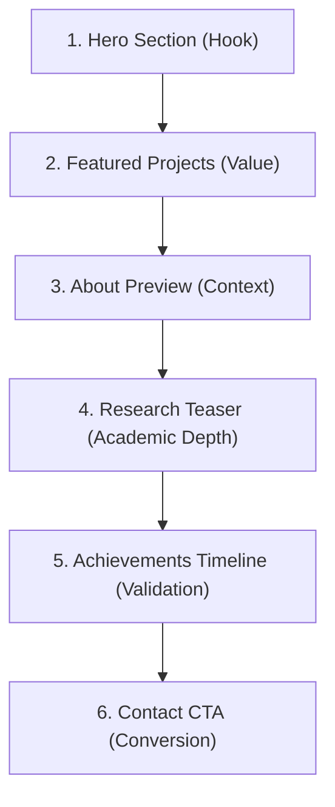

# Experience Blueprint & Information Architecture (06_Experience_Blueprint)

This document establishes the user experience (UX) layout, information architecture (IA), storytelling flow, responsive guidelines, asset structure, and component checklists for the portfolio. It serves as the master guide for Phase 1B and all subsequent page implementations.

---

## 1. Information Architecture (IA)

The portfolio is structured as a highly focused, multi-page application with a cohesive, storytelling home feed.

### Route 1: Home (`/`)
* **Purpose**: Capture immediate attention, establish professional credibility, present key work, and guide the visitor along a structured journey.
* **Target Audience**: Recruiters, Engineering Managers, Academic Collaborators.
* **Primary Message**: Sunkara Prabhu Ram Karunya is a high-performance Software Engineer & Creative Developer specializing in full-stack systems, LLM integrations, and sensor fusion research.
* **Key Content**: Hero statement, Featured Projects showcase, About preview, Research teaser, Achievements list, Contact CTA.
* **CTA**: "Explore Projects" (Primary), "Get in Touch" (Secondary).
* **Expected Interaction**: Viewport scroll triggers, card hover spring motions, micro-interactions on contact pills.

### Route 2: About (`/about`)
* **Purpose**: Share the personal narrative, academic track record, professional values, and formal credentials.
* **Target Audience**: Technical Recruiters, HR Managers, Academic Evaluators.
* **Primary Message**: Backed by strong academics (CGPA: 9.52), hackathon victories (SIH Winner), and research student experience at MulticoreWare Inc.
* **Key Content**: Bio pitch, structured Education timeline, Experience (Chapter timeline), core Values, and Skills matrix.
* **CTA**: "Download Resume (PDF)", "View Research".
* **Expected Interaction**: Timeline scroll expansion, tabbed filter toggles, accessible focus outlines on links.

### Route 3: Projects (`/projects`)
* **Purpose**: Showcase engineering depth, problem-solving skills, and tech-stack versatility through clean, filterable cards.
* **Target Audience**: Engineering Teams, Open Source Developers.
* **Primary Message**: Builds production-ready full-stack applications with elegant UIs, clean databases, and advanced APIs (Gemini, Supabase, Next.js).
* **Key Content**: Flagship featured project reveals, filterable project grid (AI & Full Stack, Research, Web App), and repository links.
* **CTA**: "View Repository on GitHub", "Launch Live Demo".
* **Expected Interaction**: Dynamic category filtering (without page reload), clean card flips/hover elevations.

### Route 4: Research (`/research`)
* **Purpose**: Document academic publications, methodologies, and engineering research findings.
* **Target Audience**: University Researchers, R&D Managers, Collaborators.
* **Primary Message**: Active researcher bridging the gap between theoretical pedagogy (PEARL prompt engineering paper) and industrial application (sensor fusion coordinate transformations).
* **Key Content**: Publication details (co-authored ICTIEE 2026 paper), research chronology (radar/LiDAR nuScenes concepts), research partners (MulticoreWare).
* **CTA**: "Read Research Paper (PDF)", "Explore PEARL Tutor Tool".
* **Expected Interaction**: Publication abstract modal toggles, external link indicator transitions.

### Route 5: Articles (`/articles`)
* **Purpose**: Share engineering insights, technical tutorials, and educational writing to demonstrate subject-matter expertise.
* **Target Audience**: Developers, Tech Enthusiasts.
* **Primary Message**: Clear technical writer capable of explaining complex frameworks, AI concepts, and software methodologies.
* **Key Content**: MDX-driven blog post cards, reading time estimation, tag categories.
* **CTA**: "Read Full Article".
* **Expected Interaction**: Smooth category transitions, reading progress line fades.

### Route 6: Contact (`/contact`)
* **Purpose**: Lower the barrier for high-intent business/academic opportunities.
* **Target Audience**: Clients, Recruiters, Collaborators.
* **Primary Message**: Easy to contact, highly collaborative, and transparently available.
* **Key Content**: Accessibility email link, social profiles grid, secure message form, availability indicator (mint pill).
* **CTA**: "Send Message".
* **Expected Interaction**: Form validation animations, success feedback, hover color mixes.

---

## 2. User Journey (The Home Feed Narrative)

The homepage operates as a continuous, structured narrative designed to retain recruiter attention and guide them through a logical funnel:

### Why this order?
1. **Hero (The Hook)**: Recruiters decide to stay or bounce in 5 seconds. The Hero delivers the unique value proposition (UVP) instantly, displaying immediate availability (mint pill) and clean visual breathing room.
2. **Featured Projects (Proof of Competence)**: Demonstrates that Karunya can build high-utility systems (NexCareer, HappySoul) right off the bat, keeping the recruiter engaged.
3. **About Preview (Human Context)**: Connects the work to the person. Explains *why* they build (B.Tech student at Kalasalingam, research focus).
4. **Research (Engineering Depth)**: Elevates credibility above standard template developers. Demonstrates academic rigor, paper publications (ICTIEE 2026), and sensor fusion experience (MulticoreWare).
5. **Achievements (Verification)**: Provides external validation (Smart India Hackathon 2025 Winner, Meritorious Scholar) to verify performance.
6. **Contact (Action)**: The natural exit point. Offers frictionless communication triggers (one-click copy email, social widgets).

---

## 3. Navigation Architecture

### Desktop Navigation
* **Structure**: Clean, sticky header (`h-16`) utilizing `@/config/theme` glass style (`glass`).
* **Elements**: Left: Logo/Initials (`KB` or `Karunya`). Center/Right: Navigation page links (Home, About, Projects, Research, Articles, Contact), Theme Toggle, and a clean "Resume" secondary button.
* **Active State**: Utilizes `next/navigation`'s `usePathname` to apply a solid active indicator (a crisp bottom underline with an accent color or a subtle text-foreground transition).
* **Scroll Response**: Sticky with `backdrop-filter: blur()`. Transition from transparent background to glass background occurs smoothly when scrolled `> 20px` down.

### Mobile Navigation
* **Hamburger Trigger**: Minimal two-bar menu icon (`lucide-react` Menu).
* **Mobile Drawer**: Slide-out panel (`components/ui/sheet.jsx`) matching dark/light variables.
* **Animation**: Staggered link fade-ins from the right on enter.
* **Footer Elements**: Replicates social links and availability pills inside the bottom drawer layout to keep them accessible.

---

## 4. Storytelling & Credibility Strategy

* **Credibility Early**: We place the co-authored ICTIEE 2026 Research Paper and the Smart India Hackathon Winner tag near the top folds (either in the Hero summary or immediately following Projects).
* **Split Editorial Layout**: Discard traditional center-aligned resume layouts. We use asymmetric columns (Left: Bold dates/companies; Right: Narratives and tech tags) to mimic premium editorial publications (such as Linear or Raycast).
* **Availability Hook**: The current status tag (available for internships and collaborations) is styled as a premium mint pill in the Hero, instantly telling recruiters they can hire the candidate.
* **No Artificial Glare**: Background glows and borders are restricted to thin, neutral, and cosmic violet accents. Recruiters should feel they are reading a clean portfolio, not a flashy gaming dashboard.

---

## 5. Section Blueprints

### Home
* **Hero**: Intro statement, short bio pitch, avatar frame (optimized), availability badge, CTA buttons.
* **Featured Projects**: Staggered project list (NexCareer, HappySoul, PEARL Tutor) displaying title, brief description, tag badges, and "View Project" links.
* **About Preview**: Typrographic quote, educational milestone summarization, CTA to full About page.
* **Research Snapshot**: Key abstract statement of PEARL Prompt Engineering Pedagogy, MulticoreWare research logo, link to Research page.
* **Achievements Summary**: Smart India Hackathon Winner 2025 badge and university merit highlights.
* **Contact Callout**: Soft glass-covered banner with active email copy button and social shortcuts.

### About
* **Personal Story**: Broad editorial paragraphs explaining interests, passion for software engineering, and AI tools.
* **Education (Chapter Timeline)**: Kalasalingam University, Chaitanya College, and school achievements.
* **Experience**: Remote Research Student role at MulticoreWare (nuScenes datasets, Coordinate Transformations, sensor fusion concepts).
* **Skills Matrix**: Organized groups (Languages, Frontend, Backend, Databases, Tools, AI, Research).
* **Values**: Minimalist cards describing architectural values (Efficiency, Simplicity, Rigor).

### Projects
* **Flagship Card**: NexCareer detailed showcase (Preview, tech details, highlights, future roadmaps).
* **Projects Grid**: All projects filterable by "All", "AI & Full Stack", "EdTech & Research", "Web Apps".
* **Case Study Preview**: Breakdown of PEARL Tutor integration.

### Research
* **Featured Publications**: Structured display of the ICTIEE 2026 paper, abstract accordion, download link, co-authors list.
* **Research Timeline**: Chronological log of study milestones (radar-to-camera, nuScenes dataset analytics, sensor fusion math).

### Articles
* **Blog Header**: Category list (AI, Next.js, Pedagogy, Web Dev).
* **Grid**: MDX article posts containing dates, reading times, titles, descriptions, and tags.

### Contact
* **Contact Matrix**: Direct messaging form (Name, Email, Message) alongside contact details (Email, Phone, Location).
* **Availability Card**: Status details, working hour zones, and active GitHub link.

---

## 6. Component Inventory

To guide development in Phase 1B, we categorize the required components:

### A. Layout
* `Container`: Responsive content-bounding wrapper.
* `Section`: Standardized spacing section wrapper (`py-20 md:py-32`).
* `PageWrapper`: Page-entrance animation wrapper handling transitions.

### B. Navigation
* `Navbar`: Sticky glass header navigation.
* `MobileDrawer`: Accessible sliding overlay.
* `ThemeToggle`: Animated Sun/Moon toggle.

### C. Typography
* `Typography`: Semantic heading/body elements mapping variant classes.
* `GradientText`: Accent-colored text headers.

### D. Interactive (shadcn extended)
* `Button`: Customized button wrapping `components/ui/button.jsx` (supporting Spring hover scale effects).
* `CustomLink`: Custom Next.js Link with animated underlines.
* `Badge`: Specialized tags for skills/status.

### E. Cards & Displays
* `ProjectCard`: Standard project grid container (glass-hover).
* `PublicationCard`: Structured academic block.
* `ExperienceRow`: Split-column timeline layout.

---

## 7. Animation Planning

Animations must remain crisp and never slow down the user's workflow.

### Section Animations

| Section | Entrance Animation | Hover Animation | Scroll Animation | Details / Timing |
| :--- | :--- | :--- | :--- | :--- |
| **Hero** | `fadeDown` / `scaleIn` | N/A | Suble parallax | Starts immediately (0ms delay) |
| **Projects** | `fadeUp` | `scale-[1.01]` + Soft Border | Staggered reveal of tags | Delay: 100ms between cards |
| **Experience**| `fadeRight` | `bg-white/5` (Dark mode) | None (Typography focus) | Clean editorial slide |
| **Contact** | `scaleIn` | N/A | None | Focus on form validation feedback |

* **Zero Motion Areas**: Long reading text blocks, database table indices, and lists inside timelines remain completely static to optimize CPU rendering.
* **Preempting Animation Bloat**: No custom mouse cursors, no trailing canvas particles, and no scroll-progress lines.
* **Reduced Motion fallback**: Framer Motion configs must bind to a `shouldReduceMotion` boolean derived from a React hook, resetting translations to `0` and using opacity fades only.

---

## 8. Responsive Strategy

* **Mobile-First Layouts**: Columns default to `grid-cols-1`. Section margins are scaled to `py-16 px-4`.
* **Tablet Scaling**: Grid columns adapt to `grid-cols-2`. Horizontal paddings adapt to `px-8`.
* **Desktop Scaling**: Content constrained to `max-w-7xl` centered with `mx-auto`. Section spacing scales up to `py-32 px-12`.
* **Touch Optimization**: Button targets satisfy standard `44px x 44px` minimum bounds for comfortable tapping on mobile devices. Hover states are deactivated on touchscreens to prevent double-tap issues.

---

## 9. Asset Planning

### Naming Conventions & Folders
All public assets reside inside `/public` organized by context:
* `/public/images/hero/`: `avatar.webp` (profile image).
* `/public/images/projects/`: `nexcareer.webp`, `happysoul.webp`, `pearl-tutor.webp`.
* `/public/favicons/`: `favicon.ico`, `icon-192.png`, `icon-512.png`.
* `/public/logos/`: `multicoreware.webp` (research partner logo).
* `/public/`: `my_resume.pdf`.

### Formats & Optimization
* **Static Graphics/Photos**: Exclusively **WebP** or **AVIF** formats.
* **SVG Vectors**: Logos and icons (lucide-react).
* **Next.js optimization**: Always utilize `next/image` to deliver pre-scaled, cached assets.

---

## 10. Content & Data Strategy

To maintain a clean division of concern, site data is separated from components:
* **Central Database (`/data`)**: All profile metrics, education timelines, projects, experiences, and social tags are imported from `/data`. No UI component may hardcode this info.
* **Articles (`/content/articles/`)**: Future blog write-ups will be stored as `.mdx` or `.md` files to allow content updates without rebuilding codebase logic.
* **Reusable UI Wrapper**: Primitives import their configurations from `/config/theme` and `/config/animations` so that modifying color spaces or timings is done in a single file edit.
